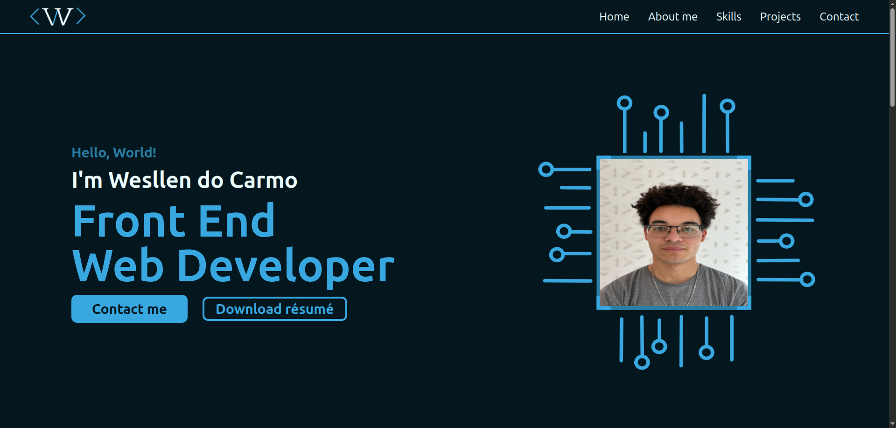
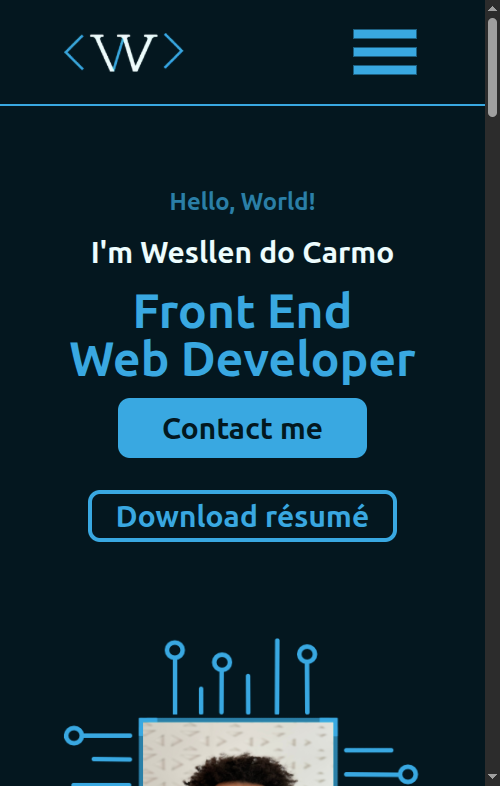

  
  
  

# Portfolio

Welcome to my Portfolio! This project is a website in whose content is focused on my published skills, projects, and experience. It was built with React.js and Tailwind CSS. I created this Portfolio in order to organise my informaiton for recruiters when applying to a Front End job. Check the deploy and get in touch with me in the contact section!

## Screenshots

### Desktop

    

### Mobile

    

## Live Preview

<a href="https://portfolio-wesllens-projects.vercel.app/">Click here</a> to visit the live preview website.

## Features

- Use of React props to build a reusable component
- Responsiveness with React.js and styles of Tailwind CSS
- Automatic email message sender

## What I learned

- How to use objects and string arrays in props
- How to create a responsive navbar with dropdown menu
- FormSubmit's usage

## Skills

- React.js
- Tailwind CSS
- HTML5
- CSS3
  
## Support

If you have any questions or suggestions about this project, feel free to contact me through my GitHub profile or email <a href="mailto:developer.wesllen@gmail.com">developer.wesllen@gmail.com</a>.

## Author

* [@WesllenCarmo](https://github.com/WesllenCarmo)

